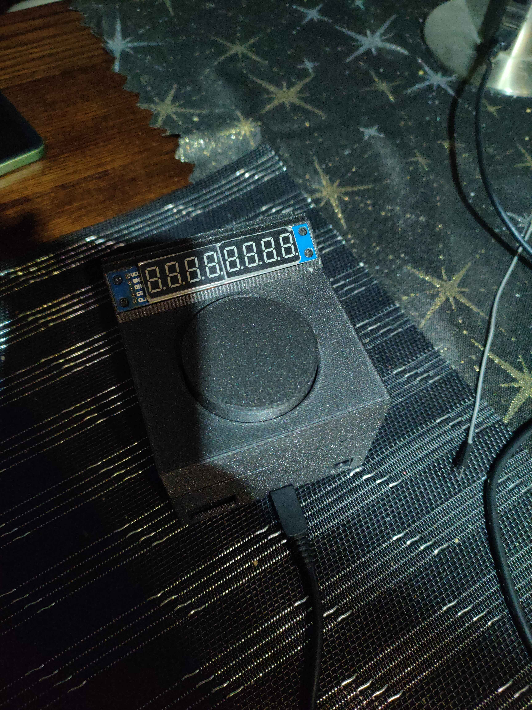
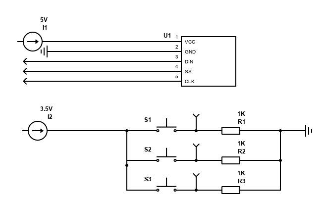

# This repository contains all files related to my arduino board game clock.

The clock folder contains the code for the device, including the [max7219 library by JemRF](https://github.com/JemRF/max7219)

Timersw contains 3d model files used to print the casing. The files however are faulty, as it was my first time working on something like this. If you plan to use them, keep in mind that they need to be modified, either with software or with an angle grinder.

